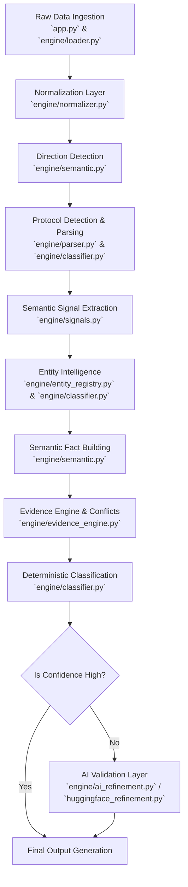

# Financial Transaction Intelligence Engine: Detailed System Flow

This document outlines the deeply detailed step-by-step pipeline of the engine, describing exactly how each stage operates and precisely which files handle the logic.

## High-Level Architecture Flowchart

---

## 1. Raw Data Ingestion & Orchestration
**Handled by:** `app.py`, `engine/loader.py`, `engine/pipeline.py`

* **How it works:** The Streamlit dashboard (`app.py`) loads an Excel or CSV file. The data is converted into a Pandas DataFrame and passed into `process_transactions(df)` within `engine/pipeline.py`. This pipeline orchestrates the entire deterministic execution flow column by column using `apply` operations.

## 2. Normalization Layer
**Handled by:** `engine/normalizer.py`

* **How it works:** `engine/pipeline.py` applies the `normalize_text(text)` function to the raw "Narration" column.
* **Logic applied:** 
  1. Casts NaN/null to empty string.
  2. Converts all text to uppercase.
  3. Strips leading and trailing whitespace.
  4. Uses regular expressions (`re.sub(r"\s+", " ", text)`) to replace any multiple consecutive spaces with a single space.
  5. Replaces hyphens (`-`) with forward slashes (`/`) to ensure unified separator patterns for the parsers down the line.

## 3. Direction Detection
**Handled by:** `engine/semantic.py`

* **How it works:** Evaluates the transaction amount to determine money flow direction.
* **Logic applied:** Determines whether a transaction is a Debit (`OUT`) or Credit (`IN`), standardizing the polarity of the transaction for the semantic fact builder.

## 4. Protocol Detection & Protocol-Aware Parsing
**Handled by:** `engine/parser.py`, `engine/classifier.py`, `engine/protocols.py`

* **How it works:** `engine/classifier.py`'s `detect_mode()` method first scans the normalized narration to infer rails (UPI, IMPS, NEFT, RTGS, ACH, CHEQUE) using `token_match()`. Based on the inferred family, `engine/parser.py` is invoked.
* **Logic applied:** `engine/parser.py` features complex, mode-specific parsing routines like `parse_upi_transaction()`. It uses heavy regular expressions to slice standard banking string shapes, explicitly extracting fields such as:
  - `transaction_prefix` (e.g., `UPI`, `REV-UPI`)
  - `transaction_subtype` (e.g., `P2A`, `P2M`, `REV`)
  - `upi_id` and `upi_handle`
  - `reference_id` (RRN)
  - `entity_name` and `bank_name`
  It returns a rich structured dictionary of these parsing outputs and attaches a `parser_rule` string and `parser_confidence` rating based on the clarity of the match.

## 5. Semantic Signal Extraction
**Handled by:** `engine/signals.py`, `engine/semantic.py`

* **How it works:** Once basic parsing is done, the narration is swept for lightweight semantic flags.
* **Logic applied:** Uses rigid token-boundary matching (e.g., `\bREV\b` or `\bSALARY\b`) rather than substring `IN` operations to prevent semantic leakage. `pipeline.py` maps these findings into boolean flags like `Bounce Flag`, `Reversal Flag`, `Salary Flag`, `Investment Flag`, `Utility Flag`, etc.

## 6. Entity Intelligence Layer
**Handled by:** `engine/entity_registry.py`, `engine/entity_intelligence.py`, `engine/classifier.py`

* **How it works:** Takes extracted names (`counterparty`) from the parsing layer or pure narration string and attempts to map them to real-world context.
* **Logic applied:** `detect_merchant()` in `classifier.py` invokes rules loaded from JSON (`rules/merchant_rules.json`). It maps raw entities (like "AMZN", "AMAZON PAY") into canonical aliases (like "AMAZON") and ties them to predefined categories ("E-COMMERCE", "TRAVEL", "INSURANCE").

## 7. Semantic Fact Assembly
**Handled by:** `engine/semantic.py`

* **How it works:** The `build_semantic_facts()` method consolidates the parsed protocol data, semantic signals, direction, and entity intelligence into a unified JSON-like fact dictionary for the given row.

## 8. Conflict Detection & Confidence Modeling (Evidence Engine)
**Handled by:** `engine/evidence_engine.py`, `engine/confidence.py`

* **How it works:** The fact dictionary is passed to `classify_facts(facts)` within `evidence_engine.py`.
* **Logic applied:** The evidence engine runs rule checks. Importantly, it analyzes overlapping rules to flag semantic conflicts (e.g., `cash_cheque_conflict` or `deposit_withdrawal_conflict`). These conflicts strictly penalize the calculation. `engine/confidence.py` holds the math for the confidence score (usually floating point 0.0 - 1.0) derived from rule priority minus conflict penalties. 

## 9. Deterministic Classification Output
**Handled by:** `engine/classifier.py` (via `classify_transaction`)

* **How it works:** The ultimate return of `classify_transaction()` wraps the result of the evidence engine. 
* **Logic applied:** Using `resolve_category()`, it maps abstract outputs into final standardized categories (e.g., converting a raw "TRANSFER" + "OUT" direction into "TRANSFER OUT"). It sets the `Category`, `Confidence`, `Conflicts`, and `Decision Path` columns in the DataFrame.

## 10. AI Refinement & Validation Layer
**Handled by:** `engine/ai_refinement.py`, `engine/huggingface_refinement.py`

* **How it works:** Used as an augmentation pipeline, this does *not* do primary classification.
* **Logic applied:** Any transaction scoring below a targeted confidence threshold (handled post-pipeline) is isolated. The semantic facts, confidence score, and deterministic category are formatted into a precise prompt. The fine-tuned LLM (called via Hugging Face/LoRA inference) processes the ambiguity and returns a refined classification to overwrite the deterministic label.
