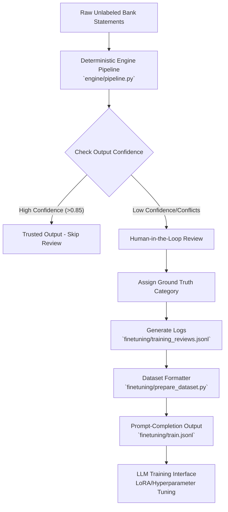

# Data Collection, Cleanup, and Training Guidelines

This document details the exact methodology for data preparation, the pipeline elements involved, and the core guidelines required when fine-tuning the LLM validation layer.

## Data Preparation & Fine-Tuning Pipeline

### Detailed Preparation Flow
1. **Raw Evaluation:** Transactions are aggressively categorized by `engine/pipeline.py`.
2. **Review Routing:** Rows flagged with low confidence or heavy semantic conflicts by `engine/evidence_engine.py` are exported for human review.
3. **Ground Truth Generation:** A human reviewer corrects the prediction and logs it into `training_reviews.jsonl`.
4. **Data Formatting (`finetuning/prepare_dataset.py`):**
   * **How it handles it:** This script opens `training_reviews.jsonl` row by row. It maps data directly into an LLM instruction prompt template containing context: `Bank`, `Direction`, `Narration`, `Predicted Category`, and `Confidence`. 
   * **Output:** It constructs a highly structured JSON object mapping `prompt` to `completion` (which contains the human `correct_category`), and saves this as `train.jsonl`.

---

## 11 Core Training & Fine-Tuning Guidelines

When managing data through `prepare_dataset.py` and pushing it to training nodes, these principles must strictly govern the approach:

1. **Data Quality is everything…** 
   Poor input data directly compromises the LLM's ability to reason over financial ambiguity.

2. **Data Proportion matters a lot.** 
   An imbalance of categories (e.g., 90% UPI Transfers and 1% Cheques) creates massive bias. Ensure diverse class distribution.

3. **Add confidence indications for guidance.** 
   As seen in `prepare_dataset.py`, providing the confidence score to the LLM teaches it when to aggressively overwrite a deterministic output versus when to subtly refine it.

4. **All fields matter.** 
   If the LLM frequently sees the `Predicted Category` field as correct during training, it acts "lazy" and learns to blindly trust the prediction instead of interpreting the actual narration.

5. **Confusing classes need diversity and clear examples for higher accuracy.** 
   For highly ambiguous pairs (like `ATM DEPOSIT` vs `CASH DEPOSIT`), inject numerous distinct, high-quality variations into the dataset.

6. **Low confidence rows add more value…** 
   Training heavily on high-confidence data encourages overfitting. The LLM simply learns to regurgitate the predicted category. Low-confidence rows force the model to genuinely learn pattern recognition.

7. **Fields like Bank act like "dialects".** 
   Retaining the `Bank` field in the prompt helps the model learn bank-specific terminology formats across varying institutions without getting confused.

8. **Choose rank, alpha, and dropout wisely…** 
   When initializing LoRA (Low-Rank Adaptation) models, tuning these hyperparameters determines whether the model becomes robust or too fragile.

9. **DO NOT OVERTRAIN…** 
   Too many epochs/iterations on small datasets cause pure memorization. The model will overfit and completely lose its ability to generalize pattern recognition for unseen examples.

10. **Data consistency matters.** 
   If `prepare_dataset.py` randomly omits a field like "Direction" for some rows, that inconsistency acts as an entirely new parameter/dimension for the model's weight matrix, severely skewing results.

11. **Model can learn bias present in script…** 
   If `prepare_dataset.py` artificially limits or alters data strings to fit criteria, the model will pick up those invisible scripts biases and point in the wrong classification direction in production.
